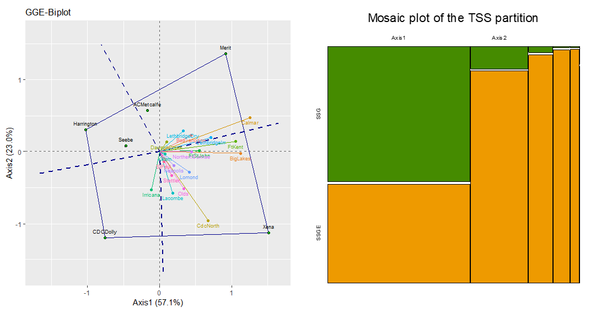

# ggebp: GGE Biplots with Mosaic Plots in R

This repository contains a standalone R function (`ggebp.r`) developed to perform Singular Value Decomposition (SVD) and construct GGE-biplots using `ggplot2`.

### The Context
I developed this tool back in 2015 to implement the GxE analysis techniques described by Laffont, Hanafi, and Wright. The function integrates numerical and graphical measures from their 2007 and 2013 papers (Crop Science 47:990-996, Crop Science 53:2332-2341).

I’m sharing this for anyone interested, it’s still fully functional in 2026. 



### Technical Highlights
Unlike standard "black-box" packages, this implementation was built from the ground up to provide transparency in the GxE (Genotype by Environment) analysis:

*   **Custom SVD Core:** Uses the `svd()` function for precise control over axis scaling and rotation.
*   **Variance Partitioning:** It explicitly calculates and prints the Sum of Squares (SS) partition for Genotype (SSG) and Interaction (SSGE).
*   **Mosaic Plot:** Includes a feature to generate a mosaic plot of the Total Sum of Squares (TSS) partition, showing the anatomy of variance at a glance.
*   **Automation:** Features an "auto-flip" logic that ensures the genotype ordinate is positively correlated with genotype means.

### Usage
The function is designed to be user-friendly, even offering a file selection window if no data is provided.
```r
source("ggebp.r")

# Yang barley dataset included in the repo, also available in 'agridat' package
yb <- read.csv("yang_barley.csv")

# Basic plot
ggebp(yb, title = "Example basic Biplot")

# Change some plot parameters, includes SS partition (mosaic plot)
ggebp(yb, mosaic = T, obs.labels = T,
    var.factor = 2, var.color="multi", line.width = 1, 
    title = "Example improved Biplot + SSP Mosaic Plot")

```

### Legacy Status

Legacy code from 2015, provided 'as-is'. It was written in Base R (old-school style), prior to the widespread use of pipes and before the Tidyverse became the standard for data manipulation.
